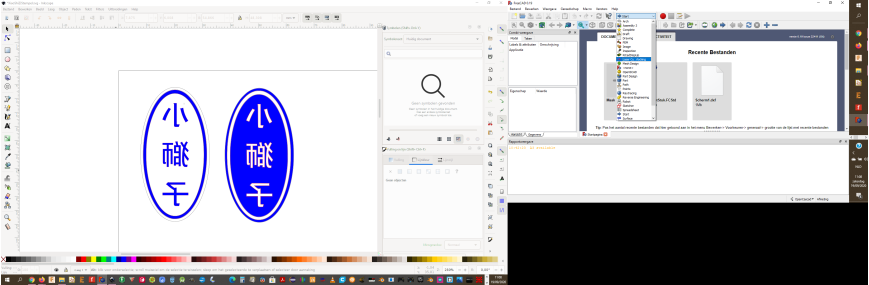
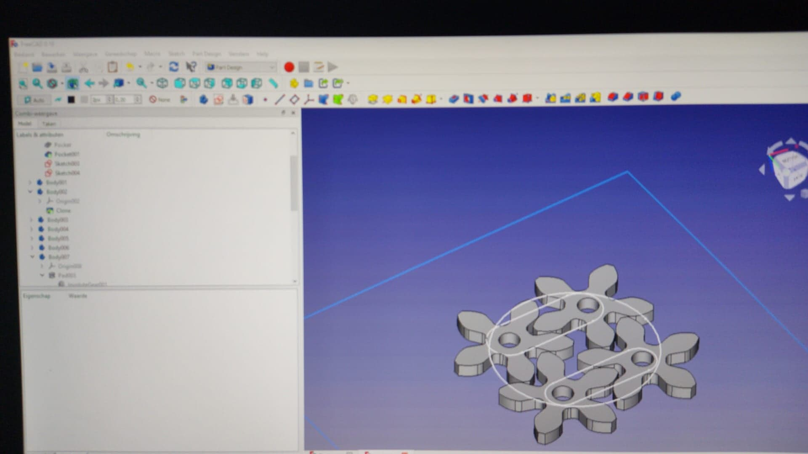
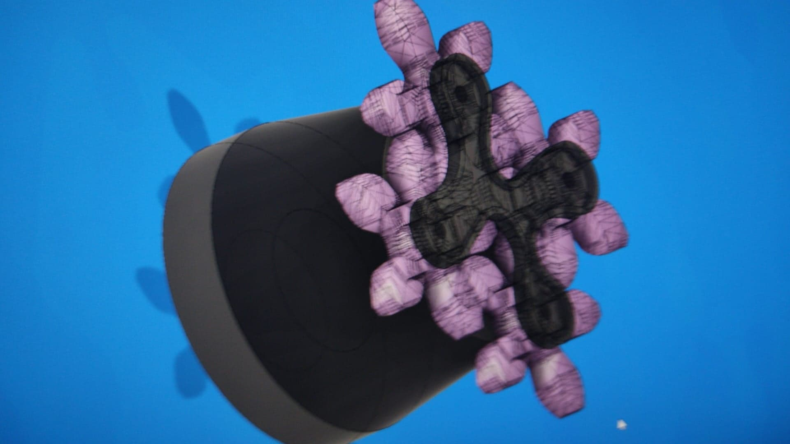
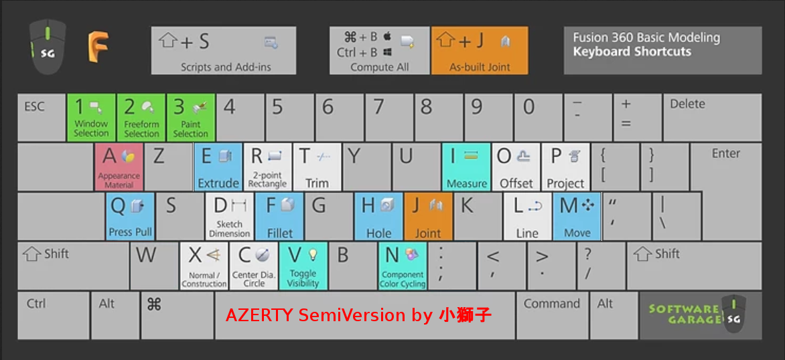

# Lessen FabZero

## Les 1 Git

Opstarten, aanmaken, opvolgen van Github pagina met documenten opgemaakt met MarkDown.

Let erop dat er een Github Site aangemaakt word. 

Vul weekelijks de vorderingen aan. <!--Hier kunnen opmerkingen staan.-->

## Les 2 Materialen en Design

Overlopen van Materialen/machines/ontwerptechnieken

## Les 3 Lasersnijden

Gebruik Inkscape, FlatFab, 123D-Make (slicer) (Mogelijkheid van FreeCad aan het uitpluizen.)

Bij gebruik FreeCad is er een Add-on beschikbaar voor het lasercutten. handig en eenvoudig te installeren.

## Les 4 3D Printen

Overzicht wat 3d printen is met kort overzicht TinkerCad, OnShape en Cura.

Opdracht: Boom slicen, Ontwerp een dopje voor op een potlood met 3d Printer als realisator.

## Les Fusion360 bis

Gebruik Fusion360 in ontwerp.

Aangepaste shortkey voor Azerty klavier. 

## Les 5 Electronica Basis

Wetten en waarden, overzicht van onderdelen zoals weerstand, Condensator, Spoel, Mosfet,  diode, spanningsregelaar, LED, Arduino.

Ook de interesante site voor simulatie/berekenen/experimenteren zonder rook kwam aan het licht. falstad.com Zeker de moeite om eens in rond te snuisteren en testen uit te voeren. Handig oa met de geluids simmulatie die ook op de luidsprekers komt. ![(falstad.com)(http://falstad.com)]

[Schemas simuleren](http://falstad.com/circuit/)

## Les OnShape bis

Gebruik OnShape in ontwerp.

Basis uitleg ivm de symbolen, hoe men een vorm opbouwd in OnShape, oefeningen.

Teken een Koffiemok.

Teken een object dat op uw bureau ligt. (Lat...)

OnShape Text... 

## Les 6a PCB's ontwerpen (KiCad)

Inleidend overzicht hoe de noodzaak ontstond om van "zwevende" schakelingen naar breadbord naar printplaat te komen. 

Waarbij nu handig gebruik word gemaakt van de computer om een pcb te ontwerpen. 

Bepalende factoren voor een printplaat zijn o.a. dikte van de koperplaat, dikker meer stroom.

Frezen voordeel HF, kortere freestijd, minder etsen door enkel de "baantjes" te frezen en GND vlak te maken. Nadeel bij gebruik glasvezel plaat spaantjes slijten de geleidingen, spanen kunnen in het moederbord komen te zitten. Voordeel van de kartonnen versie van PCB basisbord.

Nabehandeling van de printplaat is nodig om deze corosiebestendig te maken. dmv vernis, lak, silicone.

Tip bij het belichten en etsen is wrijven, de blubber/slijm laag verwijderen zodat sneller geetst kan worden. Gebruik steeds handschoenen ter bescherming.

Fe3Chloride, Waterstofchloride en zoutzuur, ... keukenmiddelen zoals azijn kan ook maar duurt langer.

Solder mask, Vertinnen, Silkscreen. Extra lagen kunnen aangebracht worden.

PCBSShopper.com vergelijk van de verschillende producenten naar gelang het ontwerp. 10x10 is goedkoopste oplossing als de print binnen die afmetinge valt.

E-Textile. 

Zeefdruk Elad

Ontwerp een printplaat voor het opnaaien van de batterij met schakelaar.

Annotate nummers van componenten voor naar footprint te gaan.

3d modellen zijn beschikbaar op 3d content central. 

GrabCad heeft ook verschillende 3d modellen van componenten.

FreeCad kan men gebruiken voor zelf een model te tekenen en het 3d model te gebruiken met KiCad.

Thx Bruce voor deze uiteeenzetting.

Nog toe te voegen enkele afbeeldingen.

KiCad liep vast bij mijn installatie gezien er nog een oudere versie ooit op de laptop stond. 

Uninstall van Kicad met wissen van de User/AppData/Roaming/KiCad/* en Opkuis Regestry windows Kicad melding zoeken en wissen bracht na herinstallatie soelaas.

## (7) Les MIT App Inventor bis

Basis uiteenzetting Android aplicatie maken met App Inventor.

Instellen op Android device, alsook op de computer voor het gebruik van het cloudbased AppInventor programma.

Eerste oefening. Maak een tekst naar spraak app. Met enkele extra features.

Tweede oefening. Maak een teken app. Bij schudden scherm terug naar beginfase. Neem foto als achtergrond. Voeg schuifbalk toe om teken dikte. Voeg keuze vlak toe voor de kleur.

Deze manier om een App te ontwikkelen werkt volgens het Scratch blok principe. (of wie was er eerst met die blok programmering ;-) )

Visueel opbouwen van het scherm met daarna blokken om de functionaliteit van de app vast te leggen.

Wat niet behandeld werd is hoe men dan de tekening kan opslaan op de gsm onder bv. Afbeeldingen map. 

Bij opzoeking stuit ik op beperkingen inzake Android 10 en 11 om een afbeelding op te slaan op het android device.

Nog verder uit te zoeken.

Er werd verwezen naar /sdcard/AppInventor/data Hoewel er geen sdcard in mijn gsm geplaatst is.

Hierdoor afgeleid niet direct gevonden waar men dan effectief opslaat.

Na invoegen van een sdcard werden de gegevens alsnog niet gevonden op de SDcard.

Dit blijkt eigenlijk nog niet te voldoen aan de regels van Google gezien er toch op het toestel zelf word opgeslagen.

Dit onder de map van *iInterne gedeelde opslag> Android> data> edu.mit.appinventor.aicompanion3> files>*i

Swat, we kunnen onze aangepaste afbeelding nu ook nadien terugvinden.

Best om deze dan ook op te slaan met een regel //fotoApp/naam.jpg zodat deze in een map volgens de app komen.

## Les Vacum vorming en mallen maken.

Overzicht van wat mallen en thermoforming inhoud, industrieel alsook de diy toestellen kwamen aan bod.

Pijnpunten bij vacumvormen en hoe op te vangen.

Bediening van het toestel te Ingegno.

De letters R & Q geformd voor afgieting te maken voor Ramses en Quillan. De S moet ik nog bijmaken.

## 8 Les Digitaal Borduren & smart textile I

Uitgebreide uiteenzetting inzake de evolutie van textiel, als warmte en bescherming naar smart met uitlees en exo functionaliteiten.

E-textile functionaliteit inbouwen in kleding, waarop dient men te letten, hoe kan men verbinden, wasbaarheid/dragen/slijtvastheid?

Uitleg en voorbeeld hoe men met InkScape uitbreiding InkStitch een vectortekening kan omzetten naar stik of steek commando's voor een borduurmachine.

Uitleg PE Design 11. Deze kan ter plaatse in Drongen gebruikt worden met de sleutel van het programma. Werkt veel sneller kwa instellingen, standaard ingebouwde functies etc.

## Les 6 Bis KiCad PCB design.

Overzicht en uitwerking pcb tekenen en ontwerpen met KiCad vanuit het Mam.

## Les 9 Digitaal Borduren & smart textile II

Praktijkles, hoe men de digitale file uitwerkt op de borduurmachine.

Aandachtspunten: strak opgespannen stof, eventueel dragende onderstof, draad is +/-0.4mm diameter, steekgrote, automatisch snijden van draad, inrijgen nieuwe kleur, max snelheid 1000 steken/min voor inschatting van tijd, ...

PE design 11 installatie voor later gebruik in Ingegno zelf. Liep even stroef, herstarte automatisch de laptop bij installatie, duurde lang om te installeren.

Gelukkig file voorbereid in InkScape/inkStitch waardoor na het zien stikken enkele wijzigingen anagebracht werden aan inkstich zoals de volgorde en het aiutomatisch snijden mbv de uitbreiding commands toe te voegen.

Eerste resultaat vanuit InkStitch laat zien dat dit wel mogelijkheden heeft maar meer voorbereiding vergt tov PE design.

HEt ontwerp kan men vanuit InkScape met .emf bestand opslaan voor PE Design.

Fotootje Patch XiaoShiZi toevoegen.


