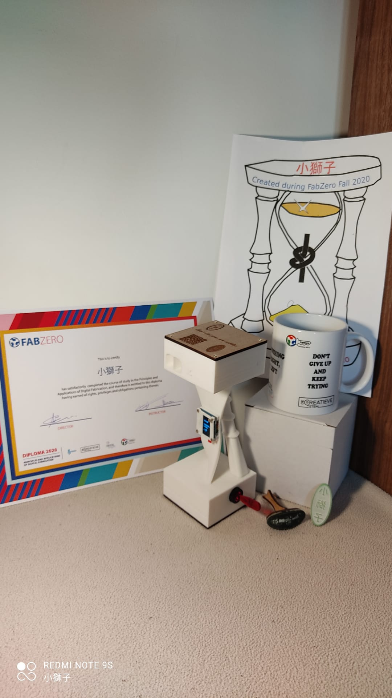

Voorstelling Project FabZero 

XiaoShiZi 小獅子


```note
 _Dit project word gedocumenteerd op Github met MarkDown documentatie._
```

# Project:

In eerste instantie was het de thermostatisch kraan die het daglicht zou zien...

Door tijdsnood en nog veel opzoekwerk te verrichten naar oa MQTT integratie, aandrijving van de klep, keuze motor tandwielen en schroef, voor tijdig een POC te kunnen presenteren word dit project even on hold geplaatst.


**_"Thermostatische kraan"_** naar Wifi gestuurd brengen. ***_ON HOLD_***

<!---Blijkbaar een hoog nodig kraantje...
14/09/2020 werd de vraag gesteld in de make in Belgium fb groep.
[Link naar FB pagina Make in Belgium](https://m.facebook.com/groups/1366008463484743?view=permalink&id=3301953146556922&ref=content_filter)
Dit voor het uitschakelen van ruimten die niet altijd dienen mee opgewarmd te worden in de loop van de dag.
Bevoorbeeld slaapkamers overdag dicht, in de vooravond laten opwarmen tot 16 graden en de living waar de thermostaat hangt s nachts laten afkoelen.
Of zelfs het niet steeds verwarmen van de ruimte met de Thermostaat.
Er word vertrokken met een thermostatische kraan waarbij reeds een motor en sturing aanwezig zijn (toekomst volledig uit te bouwen kraan met herbruik van de metalen moer op een geprinte versie ABS of PETG of siliconemal en gieten in Zelaan hittebestedig, geen vervorming door warmte van de valve/klep)
Hierbij word er een ESP8266 (Geheugen capaciteit 1MB? uitbreidbaar naar 16MB...) ) toegevoegd om de sturing via wifi mogelijk te maken.
Na korte uiteenzetting in Makerspace Ingegno te Drongen kwamen volgende bottlenecks nog naar boven.
Eigen ontwerp van de kraan maken ipv aanschaffing van een programmeerbare. 
   -
Protocol om aan te sturen zal via MQTT worden.
Server zal een RPi Zero W (19.90€) worden met een 7"Touch Screen (+/- 75€ raspberrystore.nl) of een EPaper (2" is reeds product/3335 35€ zonder touch, touch screen kan met overlay {6€} zoals product/333 maar is out of stock) als scherm. (Op te lossen dringend :-)  
Mogelijkheid verder uit te werken om via de gsm de temperatuurinstelling aan te passen (beveiliging e.d....)
Indien programmabuffer op de esp8266 (12.04€) het toelaat kan er nog een EPaper op de kraan bijkomen om vanaf daar ook de temp in te stellen.
Wemos aangeraden. Nog te bekijken naar keuze scherm.
Bijkomend zorgekindje is de gebruikstemperatuur van de ePaper. (0°-40° gezien de temperatuur van de verwarming +/-65° bedraagd zal dit moeten behandeld worden)
Afmetingen van het scherm zo snel mogelijk te bepalen voor tijdig binnen te krijgen.
Afmetingen beschikbaar van 1.54" tot 9", flexibel of vast, rond of rechthoek...
WaveShare, nu ttgo erbij, t bos word groter, keuze moeilijker... touch eInk of met draaiknop... 
## Problemen nog te voorzien van een mogelijke oplossing.
Lijst [ Add MD hier for list]
Aansturen van de motor met ESP8266 2 richtingen, Open/Dicht/Vorststand (led sensor met schijf genre muis met bal sensor X/Y)
Opmeten temperatuur/vochtigheid in de kamer/buitentemp/Open venster met terugkoppeling naar de hub.
Hub 
Aantal kranen esp8266 / uitlezingen DHT11 max mogelijk met een RPi?
Kamertemp
Logging van de temperatuur gegevens voor aansturen tijd nodig op voorhand om ruimte op temperatuur te hebben op de ingestelde tijd.)
Buitentemperatuur via website of uitlezen via ESP8266 en DHT11 in buiten centrale.
######(Prijzen op Gotron.be of Adafruit of desbetreffende site op 12/09/2020)
-->

Verder met het nieuwe project.

**_"O zandLopEr Digitaal"_** 

Reden voor een OLED digitale zandloper is de volgende:

De kinderen spelen graag eens een computergame, om hun afwisselend te laten spelen kan men de timer van de gsm gebruiken.

De jongsten heeft daar nog wat sturing bij nodig.

Vandaar het idee om een digitale versie van een timer te maken.

Dit met gebruik van een OLED scherm (ooit besteld), een buzzer, een ballswitch sensor (afkomstig uit zo'n 37kit set) en een arduino nano every.

Oeps... Bij het schrijven van de documentatie valt mijn oog op een belangrijk onderdeel...

**BELANGRIJK!** Hoe aansluiten en welke voeding word het... 

Behuizing vermoed ik om dit in een mintbox te plaatsen of nog een ontwerp uit te tekenen voor lasercutter of 3d print. 

Uit een assist to fellow student geleerd dat het steeds noodzakelijk is om de pinout goed op te zoeken en niet zomaar overnemen wat op het scherm in sommige tutorials aan bod komt. 

Dus hierbij de pinouts van de onderdelen.

Pinout schema van de Arduino Nano Every :


Pinout van het scherm (aflezen op de pcb zelf)

Pinout van de Ball switch (aflezen op de pcb zelf), Bij testen word duidelijk dat er een gewone knop op komt voor de instellingen etc.

Pinout van de Passive Buzzer (aflezen op de pcb zelf)

KiCad Schema uitgetekend met aanmaak van de scherm schema symbolen alsook de switch en buzzer.


[Schema KiCad] Toevoegen van een PNG... In KiCad de optie exporteren drawing to clipboard, binnen brengen in Gimp heeft een transparant lege zone...

OpenOffice tekst, aanpassen richting van het blad, ctrl+v paste van de drawing of clipboard. Ctrl+C en dan in Gimp Ctrl+V en eindleijk kunnen we dan de afbeelding opslaan en export als png. Pfff. Wat een gedoe om een goede documentatie te maken ;-) andere optie is print en dan de print to pdf optie gebruiken.


Eerste struikelblok ;-)  

Het scherm ooit besteld via ? Hoe vind ik terug welk scherm dit is. Terug gevonden dat dit op Wish was. 

Geen verdere uitleg van welke library of hoe men dit aansluit, huidige versie op Wish is die met de 4 pins aansluiting... 

Het OLED scherm heeft 6 aansluitpinnen genoemd als GND VCC SCL SDA RST D/C.

Na lang zoeken dan toch op de juiste aansturing van deze 6 connectoren gekomen. 

Scherm kunnen identificieren als een 0.96" OLED 128x64 SPI blue scherm.

Op naar de connecties en de library voor de arduino.

Verschillende opties voor de library om het scherm aan te sturen. Adafruit/U8g2/...

Hoe bepaald men hier de keuze?

Connecties scherm zijn als volgt: 

SCHERM/ pin nummer op Nano Every = D/C/12 - RST/11 - SDA/14 - SCL/13 - VCC/16 - GND/29

Connecties Buzzer:

Buzzer pin/Nano Every = GND/4 - VCC/16 - Signal/6

Connecties Ball Switch:

Ball Switch / Nano Every = Signal/5 - VCC/16 - GND/4

Elk onderdeel appart getest om zeker te zijn dat deze werken en aan te sturen zijn met de Nano Every

Buzzer test:

Hierbij kan men door aanpassen van de waarde,de frequantie van de blokgolf, de toonhoogte aanpassen alzo de min max bepalen waarbij de toon deftig hoorbaar is.

Link to ino file [BuzerTest.ino](https://github.com/XiaoShiZi/fabzero-XiaoShiZi/blob/master/Opdrachten/OzandLopErDdigitaalBuzzer.ino)

Ball Switch test:

Test om de gevoeligheid en positie van het contact te bepalen. Opmerking gebruik een lange usb data kabel (jammer geen aanduiding in de normering van USB om dit te vermelden op de USB-kabels) die wat bewegingsruimte met het breadbord toelaat.

Link to ino file [BallSwitchTest.ino](https://github.com/XiaoShiZi/fabzero-XiaoShiZi/blob/master/Opdrachten/OzandLopErDdigitaalBallSwitch.ino)

Output van de seriële monitor:

12:18:01.867 -> Ballknop vrij

12:18:01.867 -> Ballknop vrij

12:18:01.914 -> Ballknop vrij

12:18:01.914 -> Ballknop vrij

12:18:01.914 -> Ballknop ingedrukt

12:18:01.960 -> Ballknop ingedrukt

12:18:01.960 -> Ballknop ingedrukt

...

12:18:03.744 -> Ballknop ingedrukt

12:18:03.791 -> Ballknop ingedrukt

12:18:03.791 -> Ballknop ingedrukt

12:18:03.838 -> Ballknop ingedrukt

12:18:03.838 -> Ballknop vrij

12:18:03.884 -> Ballknop vrij

12:18:03.884 -> Ballknop vrij

Werking en uitlezing ok dus.

Testen van het OLED scherm met SPI aansturing.

Hamvraag... welke library te gebruiken...

Mijn voorkeur gaat uit naar de U8g2.lib omdat de Adafruit nog een extra deel van het geheugen inpikt indien men dit wil distribueren... 

 Written by Limor Fried/Ladyada for Adafruit Industries,
 
 with contributions from the open source community.
 
 BSD license, check license.txt for more information
 
 All text above, and the splash screen below must be
 
 included in any redistribution.
 
 Knoop is doorgehakt. Het word de U8g2 Library voor het scherm.
 
 Bij het testen van het scherm met de u8g2 library kwam volgend probleem aan het licht met de Chinese karakters.
 
 In de Chinese1, Chinese2 of Chinese3 ontbreekt het karakter 獅 (chr in 小獅子. Er is een manier om dit toe te voegen of een font te maken met enkel de nodige karakters.
 
 Bij verder testen van het scherm kwam ik op de XBMP weergave via SPI voorbeelden. Wat dan een uitleg betrof van een verouderde versie van de lib.
 
 Uiteindelijk in de uitleg van de U8g2 lib op github de nodige info en tests gevonden om mijn eigen afbeelding te maken en te vertalen naar arduino code.
 
 Ook de uitleg op de volgende site bracht licht op de pixels waardoor de gewenste afbeeldingen kunnen gemaakt en vertoont worden [sandhansblog](https://sandhansblog.wordpress.com/2017/04/16/interfacing-displaying-a-custom-graphic-on-an-0-96-i2c-oled/)
 
 
 
 
 

Opstelling op het breadbord met de verschillende onderdelen.

Afbeelding breadbord setup 

Volgende stap

Arduino programmatie van 

Timer 

Knop (knop met verschillende functies  ./../-/~ Blijken er 23 librarys in de library bibliotheek mogelijk te zijn als addon... Hoe kiezen in dit woud voor de perfecte houtsoort?)

Buzzer (Welke tune spelen voor het alarm...) [Midi2Tone](https://sparks.gogo.co.nz/midi_tone.html)

Scherm (Scherm opbouw, menus, zandkorrels vloei)

... 

Uittekenen Scherm en Behuizing.

3D Digital Resources gebruikt om het 3d model te tekenen.

[Arduino Nano Every](https://grabcad.com/library/arduino-nano-every-1)

Afmetingen in de 3d file komen niet overeen met mijn model.[OLED 1.54"](https://grabcad.com/library/oled-display-module-spi-interface-1-54-1)
Aanpassingen te doen zodat dit correct is. (Scherm is 0.96" versie)

[F360ExampleTwistedSurfaceThickn](https://youtu.be/QIfarKvvT3w)


Opstelling gemaakt met de batterijen. De stroommeting uitgevoerd. Berekend van de duur voor de baterijen op [battrijduurberekening](https://www.digikey.be/nl/resources/conversion-calculators/conversion-calculator-battery-life)
Komen we op een 999 uur of 41 dagen non stop.Lijkt mij handig om niet wekelijks de baterijen te moeten wisselen ;-)

Checking the note play for the buzzer.


De Arduino programmatie toegevoegd onder de map [ZandKnoper](https://github.com/XiaoShiZi/fabzero-XiaoShiZi/tree/master/Opdrachten/ZandKnoper)

Na het design en de 3d print de praktijktest. Net gepast ;-)


Verder gewerkt aan de 3d file waarbij alle componenten gepositioneerd werden en de bedrading kan geplaatst worden.


De Fusion file in zip formaat: [Zandknoper Fusion Zip File](https://github.com/XiaoShiZi/fabzero-XiaoShiZi/blob/master/Opdrachten/ZandKnoper%20v29.zip) 
[ Zandknoper Fusion Zip File vervolg](https://github.com/XiaoShiZi/fabzero-XiaoShiZi/blob/master/Opdrachten/ZandKnoper%20v29.z01)

Nog een diode of 2 ter bescherming tegen foutieve polariteit van de baterijpacks erbij geplaatst. Dit ter voorkoming van het ontsnappen in een rookwolkje van de magie waarop electronische onderedelen werken. Een potje reserve rook is voorhanden. 


De bedrading, solderen en monteren, op het scherm na, volledig kunnen afwerken. Nu kan er nog verder ontwikkeld worden aan het porgramma met alle onderdelen op hun vaste potitie.

Na instellen van de tientallen van de minuten en overschakelen dient men nu nog eens te duwen, dit kan aangepast worden in de programmatie zodat na vastleggen van de Tientallen er automatisch naar de eenheden word gesprongen. 

Na verlopen van de tijd dient de zandknoper ook opnieuw te starten na omdraaien van de zandknoper.

Logo startscherm aanpassen.

Visualisatie van het lopende zand toevoegen aan het aftel scherm.


Zaterdag 28/11/2020 Voormiddag. Laatste hand gelegd aan de ZandKnoper voor de diploma uitreiking.

Hiervoor werd het scherm nog voorzien van een 3d geprinte afdek- en dikteplaat alsook de bedrading bevestigd net voor het eindevent.

28/11/2020 12:26 Bij het plaatsen van de afschermplaat brak mijn schermpje...
Gelukkig had ik er nog 1tje op reserve waardoor het eind-event van start kon gaan met de aftelling door de ZandKnoper ;-)

<!-- -->



Diploma behaald. YES we kunnen meer dan we denken is een realiteit geworden ;-)

Wat volgt er nu?...

Verdere afwerking van de documentatie om te voldoen aan de verwachtingen.

Aanmaken programma om het deuntje te kunnen wijzigen. Hiervoor zal een tool ontwikkeld worden met een notenbalk-weergave en omzetting naar tone en duration array die dan eenvoudig in het programma kan geplaatst worden. Deze tool zal ddels in python geschreven worden gebaseerd op de opensource [lilypond.org](http://lilypond.org/) Bedoeling om random de verschillende deuntjes te gebruiken.

Startscherm aanpassen met de ZandKnoper.

Aftelscherm voorzien van de geanimeerde ZandKnoper.

Wat er na de uitreiking reeds verwezenlijkt werd: 

Aanpassing in de code zodat de minuten correct worden weergegeven. :-/ Kleine bug in een else definiering { zijn essentieel ;-} 

